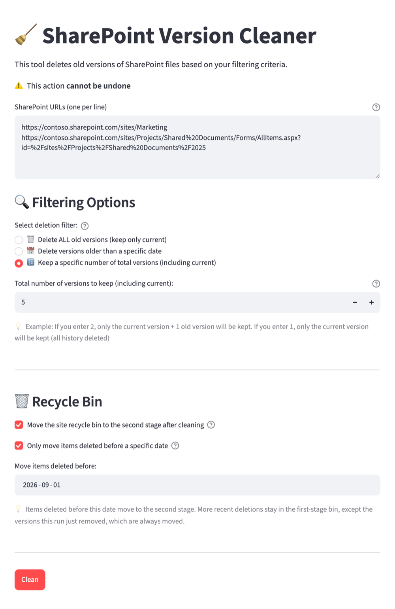

# SharePoint Version Cleaner

Delete old file versions in SharePoint Online to reclaim storage.

SharePoint keeps every version of every file, and on busy libraries the history ends up taking more space than the files themselves. This web app (Streamlit) walks the sites, libraries, folders or files you paste and deletes the versions that match a filter. It can also move the site recycle bin to the second stage, which frees space while items stay recoverable for the rest of the 93-day retention window.

> **Warning:** deleting versions is usually permanent in SharePoint Online. Try it first on a test site or a single file.



## Requirements

- Docker with Docker Compose.
- A Microsoft Entra ID App Registration with permissions on your SharePoint sites. Creating it requires a tenant administrator.

## Installation

The app uses Microsoft Entra ID app-only authentication with a client certificate. The legacy ACS model (client id + client secret) was retired by Microsoft on 2 April 2026 and no longer works.

1. Generate a self-signed certificate:

   ```sh
   openssl req -x509 -newkey rsa:2048 -nodes -days 730 \
     -keyout cert.pem -out cert.cer -subj "/CN=sharepoint-version-cleaner"
   ```

2. In Entra ID, create an App Registration.
3. Under **API permissions**, add the **SharePoint** application permission `Sites.FullControl.All` (or `Sites.Selected` to limit it to specific sites) and grant admin consent.
4. Under **Certificates & secrets**, upload `cert.cer` and copy its thumbprint.
5. Keep `cert.pem` (the private key) at the project root. It is mounted into the container at `/usr/src/app/cert.pem` and ignored by git.
6. Create the configuration file and fill in `TENANT_ID`, `CLIENT_ID`, `CERT_THUMBPRINT` and `CERT_PATH`:

   ```sh
   cp env.example .env
   ```

## Usage

```sh
docker compose up
```

Open http://localhost:8501, paste the URLs (one per line), choose a filter and press **Clean**.

## Filters

- **Delete all old versions**: keeps only the current version.
- **Delete versions older than a date**: removes the versions created before the chosen day.
- **Keep N versions**: keeps the N most recent versions, current one included.

## Supported URLs

| URL | Scope |
|---|---|
| `https://contoso.sharepoint.com/sites/Site` | Every document library in the site |
| `https://contoso.sharepoint.com/sites/Site/Shared%20Documents/Forms/AllItems.aspx` | The whole library |
| `.../Forms/AllItems.aspx?id=/sites/Site/Shared%20Documents/Folder` | That folder, recursively |
| `https://contoso.sharepoint.com/sites/Site/Shared%20Documents/Folder/file.docx` | That file |
| `https://contoso.sharepoint.com/:f:/r/sites/Site/...` | Sharing link with a resource path |

Sites under `/teams/` and the root site collection are supported too. Tokenized sharing links (`/:f:/s/...`) are not: open the item in the browser and copy the URL from the address bar.

## Recycle bin

When **Move the site recycle bin to the second stage** is enabled, the app moves the first-stage recycle bin of every processed site to the second stage once cleaning is done. You can limit it to items deleted before a date. Moved items are not purged: they can still be restored from the second-stage recycle bin until their retention period ends.

## License

GPLv3. See the [LICENSE](LICENSE) file.
